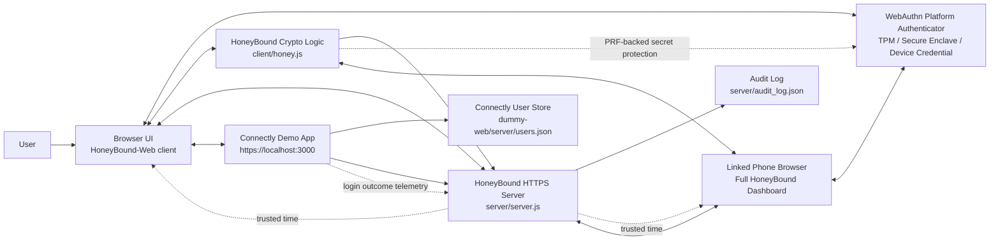
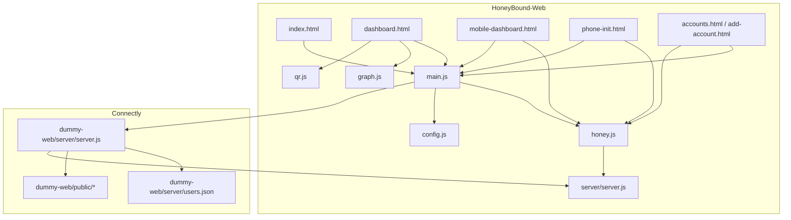
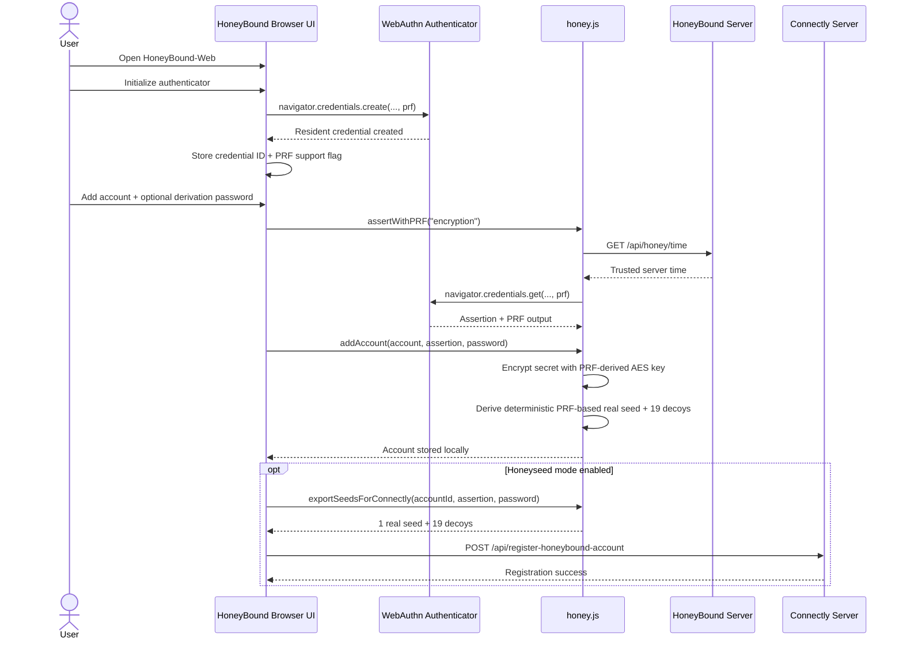
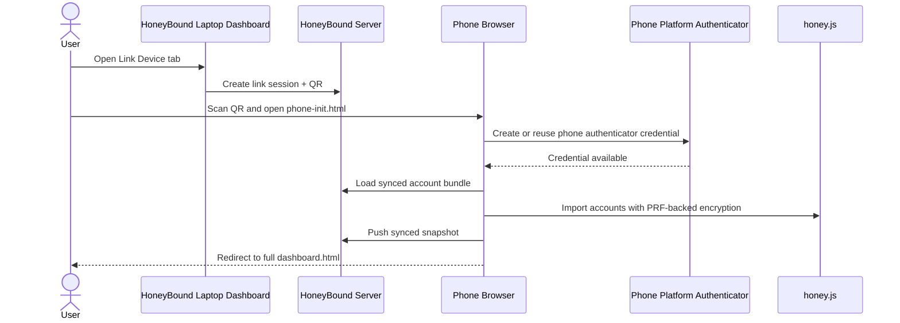
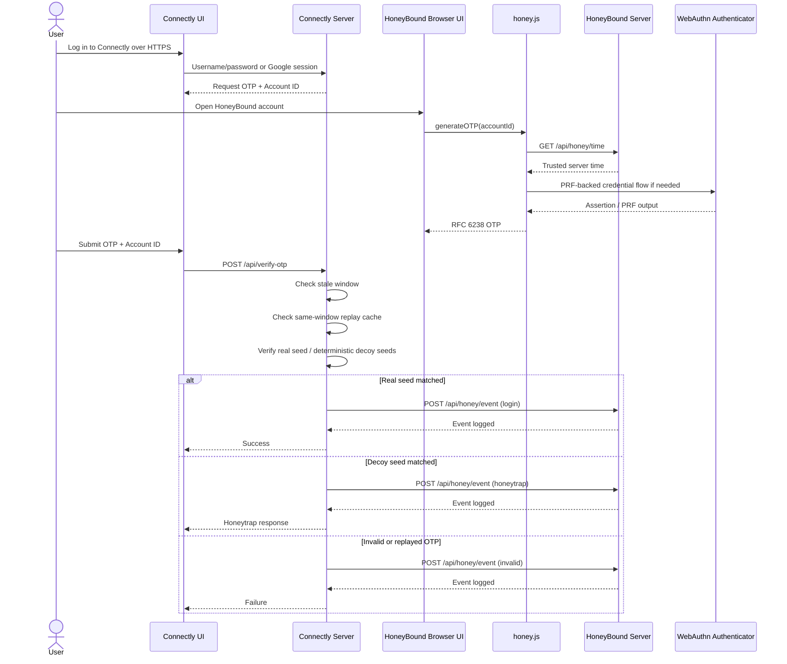
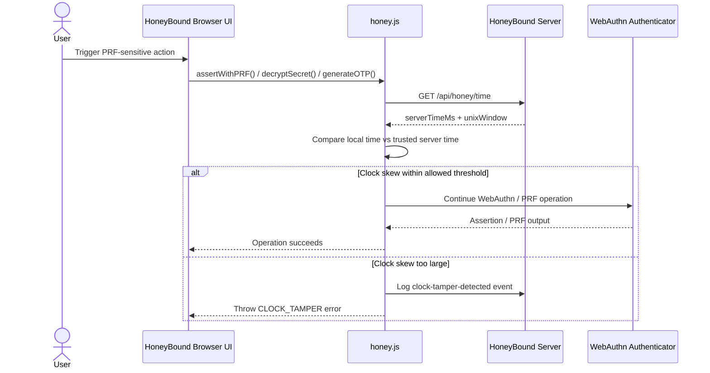
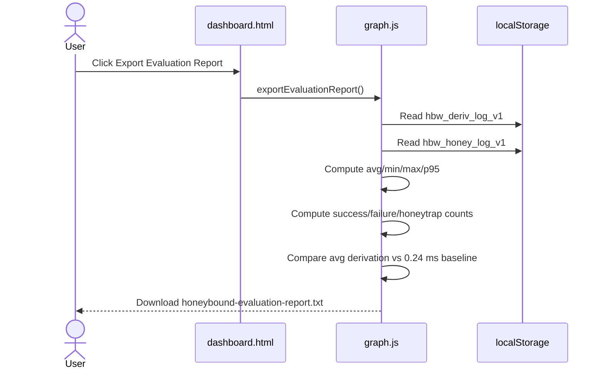

# Architecture And Sequence Diagrams

This file contains lightweight Mermaid diagrams for the HoneyBound-Web prototype and its Connectly demo integration.

## System Architecture

## Component View

## Sequence: Initial Enrolment

## Sequence: Linked Phone Becomes Full HoneyBound Client

## Sequence: OTP Login Through Connectly

## Sequence: Trusted-Time Clock Guard

## Sequence: Evaluation Export

